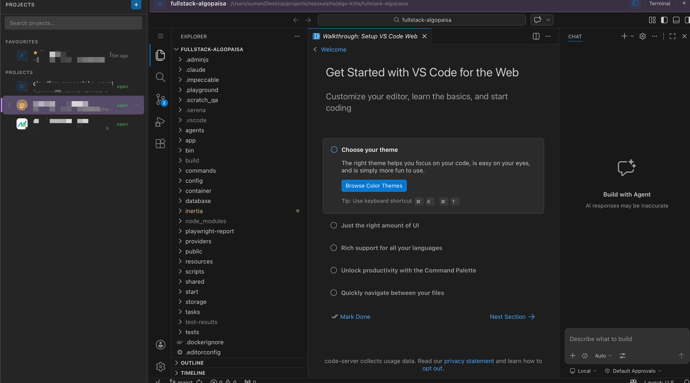

# Multi VS Code Panel

macOS app (Tauri + React) that manages multiple project folders, each backed
by a real VS Code instance embedded directly in the window.

## How it works

A true native VS Code window can't be reparented into another app's window on
macOS. Instead, each added project spawns its own [code-server](https://github.com/coder/code-server)
(VS Code running as a local web server) on a free localhost port; the right
panel embeds it via `<iframe src="http://127.0.0.1:<port>/...">`. This gives
the full VS Code UI — editor, extensions, integrated terminal — genuinely
inside the app's right panel, not a separate OS window.

- **Sidebar (left, resizable):** every added project, grouped into
  Favourites/Projects, with a status dot (idle / starting / running / error),
  search, and a per-project **⋯** menu for favouriting, an accent colour, a
  custom icon, and removing it from the list. A running project shows a close
  button on hover — that stops its VS Code without forgetting the project.
- **Right panel:** the selected project's VS Code, with a header showing its
  name/path and a **Terminal** button that reveals its integrated terminal.
  Every project that's been opened keeps its iframe mounted (just hidden) when
  you switch away, so open tabs, terminals, and unsaved edits are preserved
  instead of reloading.
- **Persistence:** the project list (name, folder path, favourite, colour,
  icon) is saved to `projects.json` in the app's data directory and reloaded
  on next launch. Running servers are not persisted — each project's VS Code
  (re)starts on first selection after launch.
- Each project gets its own `--user-data-dir` (avoids workspace-lock
  conflicts between simultaneously open projects) but shares one
  `--extensions-dir`, so an extension installed in one project is available
  in all of them — including a small local extension the app installs itself
  to power the Terminal button (see below).

## The Terminal button

Each project runs as its own `code-server` process, embedded via a
cross-origin `<iframe>`, so the app can't reach into it with JavaScript to
trigger VS Code commands directly. Instead, on first launch the app drops a
tiny local extension into the shared extensions dir. The Terminal button
writes a small command file; every running project's copy of the extension
polls that file and reveals its *own* integrated terminal only when the
command targets its own workspace folder, so only the visible project reacts.

## Requirements

- macOS
- [code-server](https://github.com/coder/code-server): `brew install code-server`
  (the app looks for it at the standard Homebrew paths, then falls back to
  `PATH`). If it's missing, the sidebar shows a banner with this command.
- Node.js + Rust toolchain, for building the app itself.

## Develop

```bash
npm install
npm run tauri dev
```

## Build

```bash
npm run tauri build
```

## Security note

Each project's code-server is started with `--auth none` and bound to
`127.0.0.1` only — it isn't reachable from the network, but **any other
process or user on the same machine** can hit that port while it's running
(no login prompt). That's an acceptable default for a single-user local dev
tool; don't run this on a shared/multi-user machine without adding
`--auth password` and passing the credentials through to the iframe.


